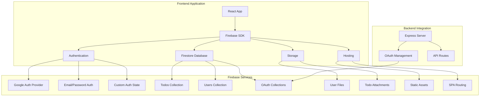
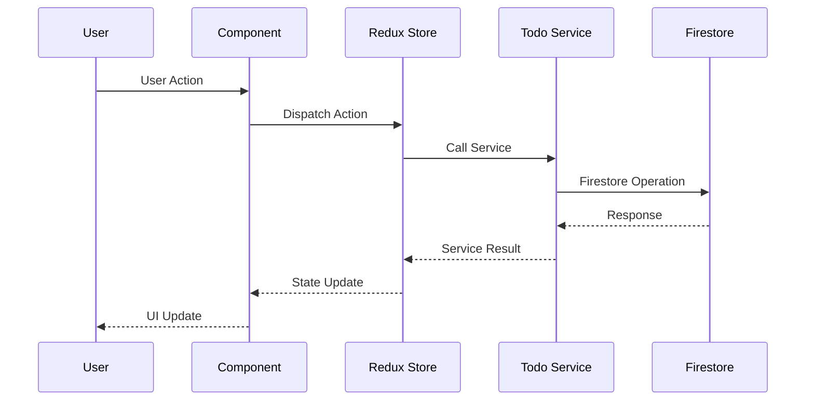
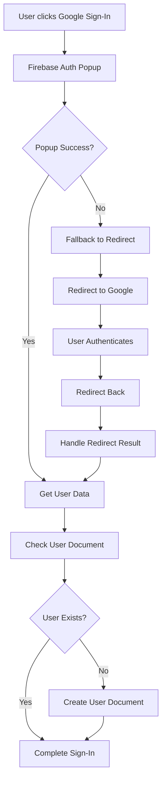
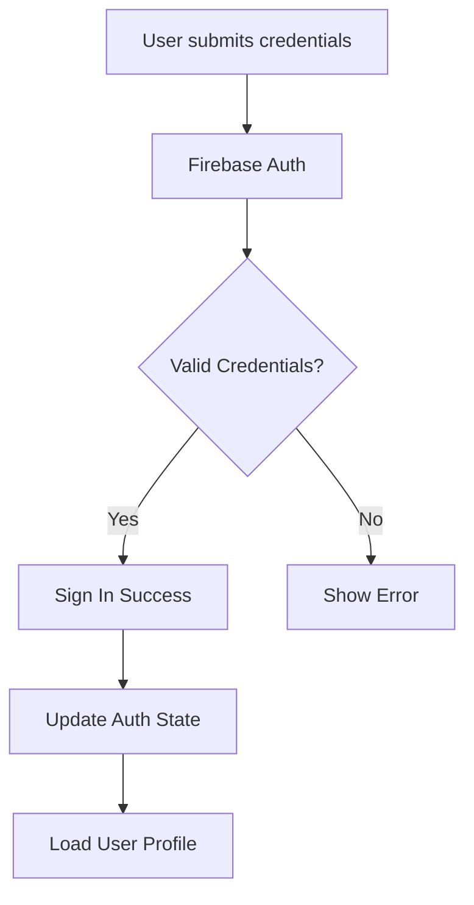

# Firebase Structure Diagram

## Overview
This document provides a comprehensive overview of the Firebase setup for the Todo application, including all services, configurations, and data flow.

## Firebase Project Configuration

```
Project ID: todo-list-e7788
Domain: todo.cox-fam.com
Storage Bucket: todo-list-e7788.firebasestorage.app
```

## Visual Architecture Diagram

```
┌─────────────────────────────────────────────────────────────────────────────────┐
│                              FIREBASE TODO APP ARCHITECTURE                    │
└─────────────────────────────────────────────────────────────────────────────────┘

┌─────────────────────────────────────────────────────────────────────────────────┐
│                              FRONTEND LAYER                                   │
├─────────────────────────────────────────────────────────────────────────────────┤
│                                                                                 │
│  ┌─────────────┐    ┌─────────────┐    ┌─────────────┐    ┌─────────────┐     │
│  │   React     │    │   Redux     │    │  Context    │    │ Components  │     │
│  │   App       │◄──►│   Store     │◄──►│  Providers  │◄──►│   (UI)      │     │
│  └─────────────┘    └─────────────┘    └─────────────┘    └─────────────┘     │
│         │                   │                   │                   │         │
│         ▼                   ▼                   ▼                   ▼         │
│  ┌─────────────────────────────────────────────────────────────────────────┐   │
│  │                        FIREBASE SDK LAYER                              │   │
│  └─────────────────────────────────────────────────────────────────────────┘   │
└─────────────────────────────────────────────────────────────────────────────────┘
                                    │
                                    ▼
┌─────────────────────────────────────────────────────────────────────────────────┐
│                            FIREBASE SERVICES                                  │
├─────────────────────────────────────────────────────────────────────────────────┤
│                                                                                 │
│  ┌─────────────┐    ┌─────────────┐    ┌─────────────┐    ┌─────────────┐     │
│  │     🔐      │    │     🗄️      │    │     📁      │    │     🌐      │     │
│  │Authentication│    │  Firestore  │    │   Storage   │    │   Hosting   │     │
│  │             │    │  Database   │    │             │    │             │     │
│  └─────────────┘    └─────────────┘    └─────────────┘    └─────────────┘     │
│         │                   │                   │                   │         │
│         ▼                   ▼                   ▼                   ▼         │
│  ┌─────────────┐    ┌─────────────┐    ┌─────────────┐    ┌─────────────┐     │
│  │Google OAuth │    │Collections: │    │User Files  │    │Static Assets│     │
│  │Email/Pass   │    │• Users      │    │Todo Attach │    │SPA Routing  │     │
│  │Auth State   │    │• Todos      │    │Metadata    │    │Custom Domain│     │
│  │             │    │• OAuth      │    │            │    │             │     │
│  └─────────────┘    └─────────────┘    └─────────────┘    └─────────────┘     │
└─────────────────────────────────────────────────────────────────────────────────┘
                                    │
                                    ▼
┌─────────────────────────────────────────────────────────────────────────────────┐
│                              BACKEND LAYER                                    │
├─────────────────────────────────────────────────────────────────────────────────┤
│                                                                                 │
│  ┌─────────────┐    ┌─────────────┐    ┌─────────────┐                        │
│  │   Express   │    │   OAuth     │    │   API       │                        │
│  │   Server    │───►│ Management  │───►│  Routes     │                        │
│  │             │    │             │    │             │                        │
│  └─────────────┘    └─────────────┘    └─────────────┘                        │
│         │                   │                   │                              │
│         ▼                   ▼                   ▼                              │
│  ┌─────────────┐    ┌─────────────┐    ┌─────────────┐                        │
│  │   Server    │    │   Token     │    │   Auth      │                        │
│  │   Logging   │    │ Management  │    │ Validation  │                        │
│  │   & Error  │    │   & OAuth   │    │   & API     │                        │
│  │   Handling │    │   Clients   │    │   Security  │                        │
│  └─────────────┘    └─────────────┘    └─────────────┘                        │
└─────────────────────────────────────────────────────────────────────────────────┘

┌─────────────────────────────────────────────────────────────────────────────────┐
│                              DATA FLOW                                        │
├─────────────────────────────────────────────────────────────────────────────────┤
│                                                                                 │
│  User Action → Component → Redux Store → Todo Service → Firestore → Response   │
│       ↑                                                                  │      │
│       └──────────────────────────────────────────────────────────────────┘      │
│                                                                                 │
│  ┌─────────────┐    ┌─────────────┐    ┌─────────────┐    ┌─────────────┐     │
│  │   👤 User  │    │   🎯       │    │   🔄       │    │   📊       │     │
│  │   Input    │───►│  Component  │───►│  Redux      │───►│  Service    │     │
│  └─────────────┘    └─────────────┘    └─────────────┘    └─────────────┘     │
│                                                                                 │
│  ┌─────────────┐    ┌─────────────┐    ┌─────────────┐    ┌─────────────┐     │
│  │   🗄️       │    │   📤       │    │   🎨       │    │   👤       │     │
│  │  Firestore │◄───│  Response   │◄───│  State     │◄───│  UI Update  │     │
│  └─────────────┘    └─────────────┘    └─────────────┘    └─────────────┘     │
└─────────────────────────────────────────────────────────────────────────────────┘

┌─────────────────────────────────────────────────────────────────────────────────┐
│                              SECURITY MODEL                                   │
├─────────────────────────────────────────────────────────────────────────────────┤
│                                                                                 │
│  ┌─────────────────────────────────────────────────────────────────────────┐   │
│  │                    🔒 FIREBASE SECURITY RULES                          │   │
│  │                                                                         │   │
│  │  • Users can only access their own data                                │   │
│  │  • Todos are isolated by userId                                        │   │
│  │  • File storage requires authentication                                 │   │
│  │  • OAuth operations are server-validated                               │   │
│  │                                                                         │   │
│  └─────────────────────────────────────────────────────────────────────────┘   │
│                                                                                 │
│  ┌─────────────────────────────────────────────────────────────────────────┐   │
│  │                    🛡️  AUTHENTICATION FLOW                             │   │
│  │                                                                         │   │
│  │  Google OAuth → User Profile Check → Create/Update User Doc → Complete  │   │
│  │                                                                         │   │
│  └─────────────────────────────────────────────────────────────────────────┘   │
└─────────────────────────────────────────────────────────────────────────────────┘

┌─────────────────────────────────────────────────────────────────────────────────┐
│                              DEPLOYMENT                                       │
├─────────────────────────────────────────────────────────────────────────────────┤
│                                                                                 │
│  ┌─────────────┐    ┌─────────────┐    ┌─────────────┐    ┌─────────────┐     │
│  │   🧪       │    │   🚀       │    │   🌍       │    │   📊       │     │
│  │  Testing   │───►│  Build     │───►│  Deploy    │───►│  Monitor   │     │
│  │  (Jest +   │    │  (Vite)    │    │  (Firebase │    │  (Logs +   │     │
│  │  Playwright)│    │             │    │  Hosting)  │    │  Analytics) │     │
│  └─────────────┘    └─────────────┘    └─────────────┘    └─────────────┘     │
│                                                                                 │
│  Custom Domain: todo.cox-fam.com                                               │
│  Project ID: todo-list-e7788                                                   │
│  Storage: todo-list-e7788.firebasestorage.app                                 │
└─────────────────────────────────────────────────────────────────────────────────┘
```

## Services Architecture



## Data Models

### Firestore Collections

#### 1. Users Collection (`/users/{userId}`)
```typescript
interface User {
  uid: string;           // Firebase Auth UID
  email: string;         // User email
  displayName: string;   // User display name
  createdAt: string;     // ISO timestamp
  photoURL?: string;     // Profile photo URL
}
```

#### 2. Todos Collection (`/todos/{todoId}`)
```typescript
interface Todo {
  id: string;            // Document ID
  userId: string;        // Owner's UID
  title: string;         // Todo title
  description?: string;  // Optional description
  completed: boolean;    // Completion status
  priority?: string;     // Priority level
  dueDate?: Date;        // Optional due date
  createdAt: Timestamp;  // Firestore timestamp
  updatedAt: Timestamp;  // Last update timestamp
}
```

#### 3. OAuth Collections
```typescript
interface OAuthClient {
  clientId: string;      // OAuth client identifier
  // Additional OAuth configuration
}

interface OAuthToken {
  tokenId: string;       // Token identifier
  // Token data and metadata
}
```

## Security Rules

### Firestore Rules
```javascript
// Users can only access their own data
match /users/{userId} {
  allow read, write: if request.auth != null && request.auth.uid == userId;
}

// Users can only access their own todos
match /todos/{todoId} {
  allow read, write: if request.auth != null && request.auth.uid == resource.data.userId;
  allow create: if request.auth != null && request.auth.uid == request.resource.data.userId;
}

// OAuth collections (server-managed)
match /oauth_clients/{clientId} {
  allow read, write: if true; // Server-side validation
}

match /oauth_tokens/{tokenId} {
  allow read, write: if true; // Server-side validation
}
```

### Storage Rules
```javascript
// User files
match /users/{userId}/{allPaths=**} {
  allow read, write: if request.auth != null && request.auth.uid == userId;
}

// Todo attachments
match /todos/{todoId}/{allPaths=**} {
  allow read, write: if request.auth != null && 
    request.auth.uid == resource.metadata.userId;
}
```

## Database Indexes

### Firestore Indexes
```json
{
  "indexes": [
    {
      "collectionGroup": "todos",
      "fields": [
        {"fieldPath": "userId", "order": "ASCENDING"},
        {"fieldPath": "createdAt", "order": "DESCENDING"}
      ]
    },
    {
      "collectionGroup": "todos", 
      "fields": [
        {"fieldPath": "userId", "order": "ASCENDING"},
        {"fieldPath": "completed", "order": "ASCENDING"},
        {"fieldPath": "createdAt", "order": "DESCENDING"}
      ]
    },
    {
      "collectionGroup": "todos",
      "fields": [
        {"fieldPath": "userId", "order": "ASCENDING"},
        {"fieldPath": "priority", "order": "ASCENDING"},
        {"fieldPath": "createdAt", "order": "DESCENDING"}
      ]
    }
  ]
}
```

## Application Architecture

### Frontend Layer
```
src/
├── firebase.js          # Firebase configuration & initialization
├── contexts/
│   └── AuthContext.jsx  # Authentication state management
├── services/
│   └── todoService.js   # Firestore CRUD operations
├── store/
│   └── todoSlice.js     # Redux state management for todos
└── components/          # UI components
```

### Data Flow


## Authentication Flow

### Google Sign-In


### Email/Password Sign-In


## Hosting Configuration

### Build & Deploy
```json
{
  "hosting": {
    "public": "dist",
    "ignore": [
      "firebase.json",
      "**/.*",
      "**/node_modules/**",
      "**/tests/**",
      "**/src/**"
    ],
    "rewrites": [
      {
        "source": "**",
        "destination": "/index.html"
      }
    ]
  }
}
```

### Caching Strategy
- **JavaScript/CSS**: 1 year cache
- **Images**: 1 year cache
- **SPA Routing**: All routes serve index.html

## Development & Testing

### Local Development
- Firebase Emulator Suite (configured but not actively used)
- Real Firebase services for development
- Comprehensive logging and error handling

### Testing Strategy
- Jest for unit tests
- Playwright for E2E tests
- Real Firebase database for tests (no mocking)
- Coverage reporting enabled

## Security Considerations

### Authentication
- Google OAuth with custom parameters
- Email/password authentication
- Secure session management
- Auth state persistence

### Data Access
- User isolation (users can only access their own data)
- Server-side OAuth management
- Secure file storage with user isolation
- Comprehensive security rules

### API Security
- Firebase Auth integration
- Server-side validation for OAuth operations
- Secure token management

## Monitoring & Logging

### Client-Side Logging
- Comprehensive console logging for debugging
- Error tracking and reporting
- Performance monitoring

### Server-Side Logging
- OAuth operation logging
- API request/response logging
- Error tracking and reporting

## Deployment

### Production Environment
- Firebase Hosting for frontend
- Firestore for database
- Firebase Storage for files
- Custom domain (todo.cox-fam.com)

### CI/CD Pipeline
- Automated testing on pull requests
- Deployment scripts for production
- Environment-specific configurations

---

*This diagram represents the current Firebase setup as of the latest configuration. For any updates or modifications, please refer to the actual configuration files in the project.*
